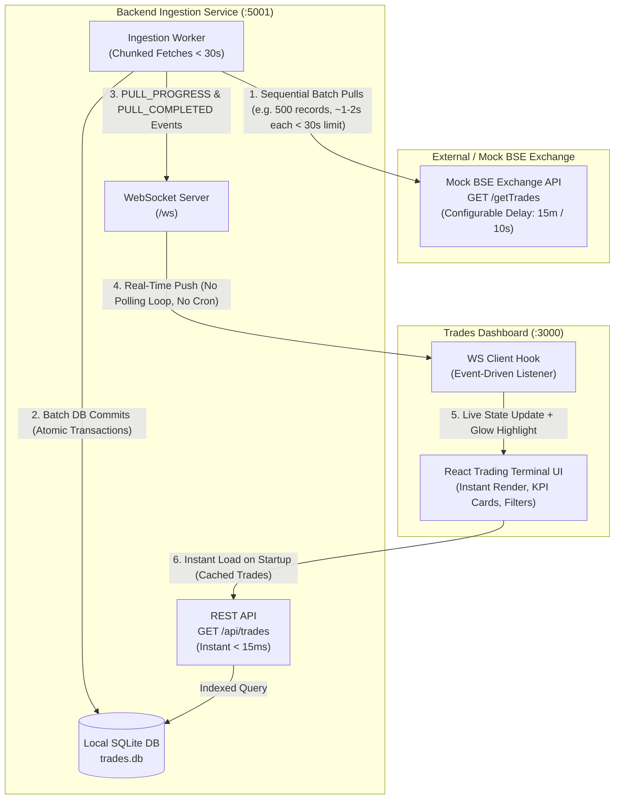
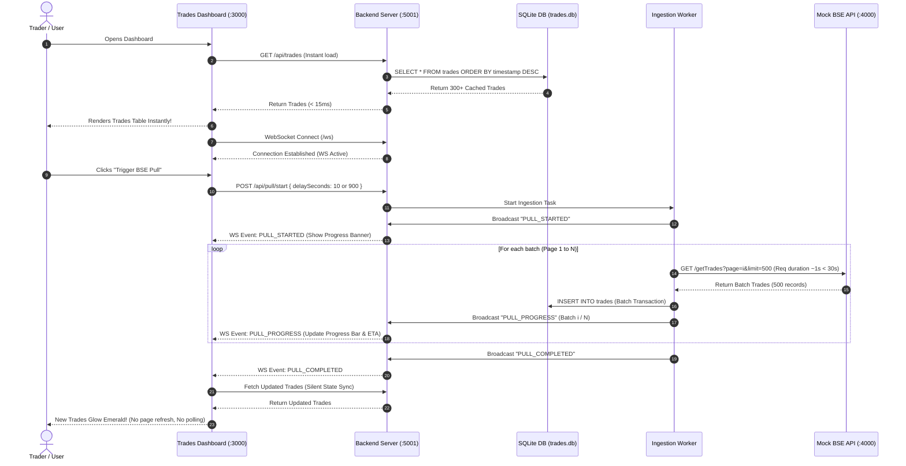

# System Architecture & Technical Design Note

## 1. Problem Statement & Scenario Analysis

**Scenario:**
> We pull trade data from the BSE Exchange API. A full pull takes up to 15 minutes, and our network kills any HTTP connection held open longer than 30 seconds.

### The Core Technical Paradox:
- **Total Ingestion Duration:** Up to 15 minutes (\~900 seconds) of trade generation / transfer.
- **Enterprise Network Policy:** Any HTTP connection held open $> 30\text{s}$ is forcefully killed by the reverse proxy / API gateway / stateful firewall (`504 Gateway Timeout` or `ECONNRESET`).
- **Naive Failure:** If a client makes a monolithic `GET /getTrades` request expecting all records after 15 minutes, the TCP connection will be terminated at second 30, failing every single time.

---

## 2. High-Level Architecture Overview

To overcome these constraints, the system is designed with a **Decoupled Resilient Ingestion Worker**, a **Fast Indexed Local Store**, and an **Event-Driven WebSocket Broadcast Pipeline**.

---

## 3. Key Design Decisions & Why This Architecture

### A. Resilient Chunked Windowing (Overcoming the 30-Second Limit)
Instead of attempting a single monolithic 15-minute HTTP connection, the Ingestion Worker partitions the pull into sequential batches:
- `GET /getTrades?page=1&limit=500&delay=900`
- Each batch takes a fraction of the time (e.g. $\approx 1-2\text{s}$ or up to $20\text{s}$ under full 15-minute simulation).
- Every single HTTP connection completes and closes **well below the 30-second network kill threshold**.
- The client timeout is explicitly capped at $28\text{s}$ with an `AbortController` to guarantee compliance.

### B. Instant Dashboard Load via Local Cache
- **Requirement:** *"Dashboard opens instantly, showing trades already pulled — even while a pull is in progress."*
- **Solution:** Trades are persisted immediately into a high-performance local SQLite database (`node:sqlite`) with indexes on `symbol`, `timestamp`, and `client`.
- When a user opens the dashboard, `GET /api/trades` queries local SQLite and renders the UI in **$< 15\text{ms}$**, completely independent of the exchange network latency.
- If a pull is currently in progress, the dashboard displays existing trades while simultaneously rendering a live ingestion banner showing active batch progress, elapsed time, and ETA.

### C. Zero Polling Loop, Zero Cronjob, Zero Page Refresh
- **Requirement:** *"When a pull completes, new trades appear on the open dashboard automatically — no page refresh, no polling loop, no cronjob/scheduler."*
- **Solution:**
  1. **No Polling Loop:** The frontend makes **zero** periodic `setInterval` or recursive `setTimeout` fetch calls.
  2. **No Cronjob/Scheduler:** Pulls are event-driven (triggered by user action, API trigger, or exchange webhook).
  3. **No Page Refresh:** Updates are pushed via bidirectional **WebSockets** (`/ws`).
  4. When the ingestion engine finishes the final batch, it emits a `PULL_COMPLETED` payload. The React dashboard catches the event, updates its internal state seamlessly, and highlights new trades with an emerald glow animation.

---

## 4. End-to-End Sequence Diagram

---

## 5. Technology Stack

| Layer | Technology | Rationale |
|---|---|---|
| **Mock BSE API** | Node.js, Express, TypeScript | Lightweight, seeded with 5,000 realistic BSE trades, configurable delay & timeout simulation |
| **Backend & Ingestion** | Node.js, Express, `node:sqlite`, `ws` | Zero-dependency native SQLite engine, high-speed transactions, native WebSockets |
| **Frontend Dashboard** | React 19, TypeScript, Vite, Tailwind CSS 4, Lucide | Instant HMR, responsive trading terminal aesthetic, accessible data tables |
| **Real-Time Push** | WebSockets (`ws`) | Event-driven architecture eliminating HTTP polling and cron dependencies |
